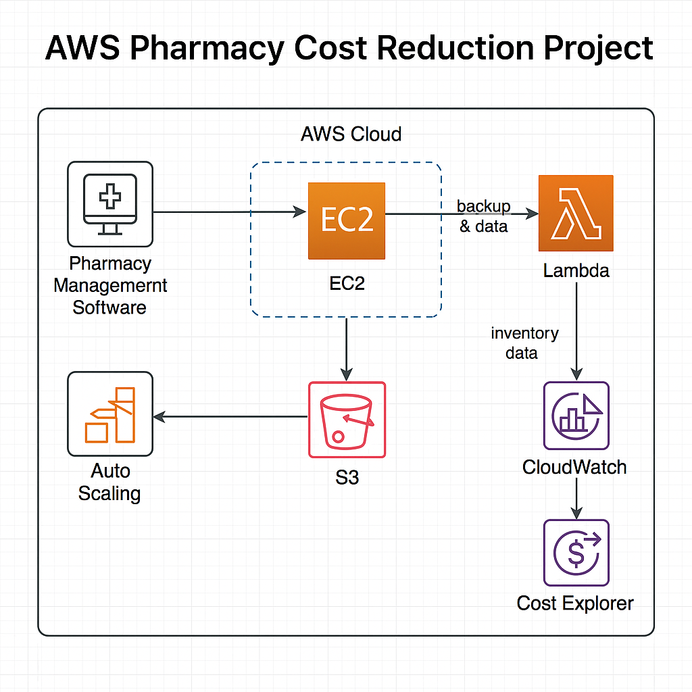

# 💊 AWS Pharmacy Cost Reduction Platform

A backend platform built to compare and reduce pharmaceutical prices using a scalable Python-based stack. This project simulates a pricing intelligence tool for pharmacies, using cloud-native deployment and real-world data simulation.

## Overview

This project aims to reduce operational costs in pharmacies by implementing cost-efficient AWS services. We’ve used **Amazon EC2**, **Amazon S3**, and **AWS Lambda** to streamline infrastructure, optimize data storage, and automate workflows, ultimately reducing costs.

## Services Used

- **Amazon EC2 (Elastic Compute Cloud)**: Hosting pharmacy management software on scalable virtual machines.
- **Amazon S3 (Simple Storage Service)**: Scalable storage for backup and patient data.
- **AWS Lambda**: Automating inventory management and other tasks with serverless computing.

## Architecture

### 🔧 Tech Stack
- Python · Flask · MySQL
- AWS EC2, Lambda, RDS
- Docker · Postman · Git

### 📦 Features
- RESTful API for product price submission and querying
- MySQL schema to store pricing and product details
- Automated price comparisons with threshold alerts
- Deployed via Docker and tested using Postman

## Implementation Steps

### 1. **Amazon EC2 Setup**

- Launched an EC2 instance to host pharmacy management software.
- Installed Apache, MySQL, and other necessary software.
- Configured **Auto Scaling** for cost optimization.

### 2. **Amazon S3 Setup**

- Created an S3 bucket (`pharmacy-data-backups`).
- Configured lifecycle policies to move old data to cheaper storage (e.g., **S3 Glacier**).
- Used AWS CLI to upload backup data to S3.

### 3. **AWS Lambda Setup**

- Created a Lambda function to automate inventory updates.
- Integrated with S3 to store updated inventory data.
- Triggered Lambda based on S3 events or API calls.

### 4. **Monitoring and Optimization**

- Configured **AWS CloudWatch** to monitor EC2 instances and Lambda functions.
- Set up **AWS Cost Explorer** to track and optimize costs.

## Cost Savings

By leveraging AWS services, the pharmacy reduced its infrastructure and data storage costs significantly. The dynamic scaling of EC2 instances, pay-per-use Lambda functions, and low-cost S3 storage helped lower overall expenses.
